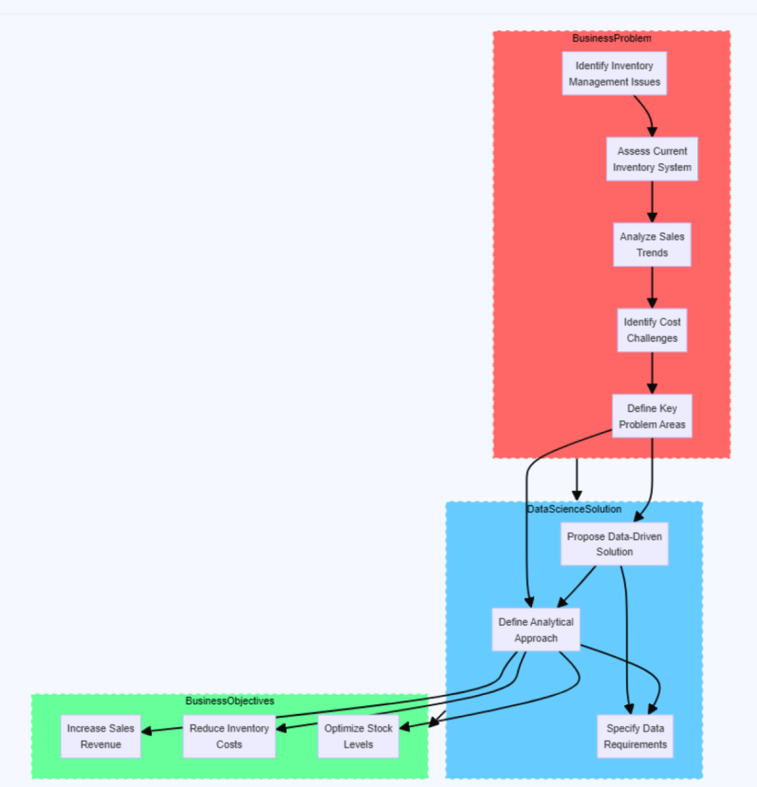

<h1 align="center">Unveiling the Data Science Alchemy: A Comprehensive Methodology</h1>

          We've covered the stages of the data science methodology up to evaluation. In this section, we'll discuss crucial next steps such as model deployment and feedback. Before delving into that, let's explore a basic Inventory Optimization flowchart to better grasp the potential optimization contributions of data science.

          Above diagram shows us the basic stages where Inventory optimization could take place with data science.
          
---

### Step 6 deployment to Feedback - Real World Deployment, Feedback and Redeployment

Maximizing data science impact through stakeholder engagement and Iterative refinement.

1. **Stakeholder Engagement** - 
    
Making the answer relevant and useful involve engagign staeholders. Stakeholders include solution owners, marketign, IT admins, developers. Diverse specialists ensure model's applicability.

2. **Deployment and Feedback** - 

Deploy the evaluated model with data scientist's confidence for real-time unctinality testing.User feedack is critical for refining, evaluating, and enhancing model performance.
 
3. **Iterative Process** - 
        
The cyclical methodology refines each stage.Feedack spurs continuous learning and enhancement.Refinement relies on post implementation data and Knowledge.Further improvement can arise from feedack.

4. **Improvement and redeployment** - 
        
Integrate feedack insights to reine model and interventions.Redeploy refined model and actions, sustaining feedback.Loop ensures ongoing improvement and impact assessment, especially. Include ethical considerations.

---

### Conclusion

   In the dynamic realm of data science, where insights are currency and innovation is key, a well-defined methodology serves as the guiding compass.Our journey through the data science lifecycle, from Business understanding to feedback,  illuminates the intricacies and nuances that shape the path to actionale intelligence.
   As we conclude this exploration, several key takeaways emerge:
   
#### 1. Business-Driven Decision Making:
The methodology emphasizes a business-centric approach, ensuring that every analytical endeavor aligns with overarching organizational goals. By defining clear objectives and metrics, we bridge the gap between data science and tangible business impact.

#### 2. Iterative and Adaptive Processes:
The iterative nature of our methodology acknowledges the dynamic nature of data and problem spaces. Continuous evaluation, feedback loops, and adaptability are the cornerstones of success in a landscape that evolves at a rapid pace.

#### 3. Collaborative Cross-Functional Teams:
Effective data science extends beyond the domain of data scientists. Our methodology encourages collaboration among cross-functional teams, fostering synergy between domain experts, data engineers, and business stakeholders. This collaborative spirit ensures a holistic understanding of problems and solutions.

#### 4. Ethical Considerations and Responsible AI:
Ethical considerations are woven into the fabric of our methodology. From transparent data collection practices to the responsible deployment of models, ethical guidelines serve as a compass to navigate the ethical challenges inherent in the field.

#### 5. Continuous Learning and Improvement:
Data science is a journey of perpetual learning. The methodology is not a rigid set of rules but a flexible framework that invites continuous improvement. Embracing new tools, techniques, and advancements ensures relevance and efficacy in an ever-evolving landscape.

In closing, our data science methodology is more than a set of steps—it's a philosophy that encapsulates the spirit of exploration and discovery. Whether you are embarking on your first data science project or are a seasoned practitioner, may this methodology be a valuable companion in your pursuit of data-driven excellence.

As we bid adieu to this exploration, remember: the data science journey is ongoing, and each analysis is a step closer to unlocking the full potential of data.

Happy analyzing!
        
---
